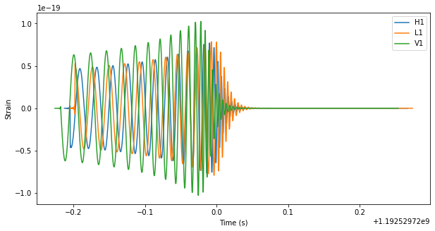

Utilities for lstm model using gravitaion waves 

### Instalation: 

### venv activation:
```bash
python3 -m venv env
```
Activation:
```bash
. env/bin/activate
```

### Instalation requirements: 


```bash
pip install -r requirements.txt
```

```bash
# We'll first download some data for this demonstration
!curl -O -J -L https://losc.ligo.org/s/events/LVT151012/H-H1_LOSC_4_V2-1128678884-32.gwf
```

Parameters for generating one waveform in multiple detectors
```python
from generator_waveform import generate_wave

apx = 'SEOBNRv4'


params = {
    'approximant':apx,
    'mass1':100,
    'mass2':10,
    'spin1z':0.9,
    'spin2z':0.4,
    'inclination':1.23,
    'coa_phase':2.45,
    'delta_t':1.0/4096,
    'f_lower':40
}

signal_h1, signal_l1, signal_v1 = generate_wave(params)
```


# Gradient Clipping 
```python
import keras.optimizers as optim

opt = optim.Adam(clipvalue=1,lr = 0.001)
model.compile(optimizer=opt, loss='mse')
```

# Generated dataset 

Simple command: 
```bash
	python dump_dataset.py -m1=10 -m2=20 -n=100 -time_steps=300 -quark=True
```

### Generate dataset parameters

* m1 -- first mass of black hole, 
* m2 -- second mass of black hole,
* -n  -- numbers of signals,
* -time_steps -- lengh of signal,
* -create one feature with quark mass using rule```Mc = (m1*m2)^(3/5)/(m1 + m2)^{1/5}```

Datasets are stored into .hkl files. Example paterns of files ```D-SET-norm(100,300).hkl```


References:
* https://dcc.ligo.org/LIGO-P1800129/public
